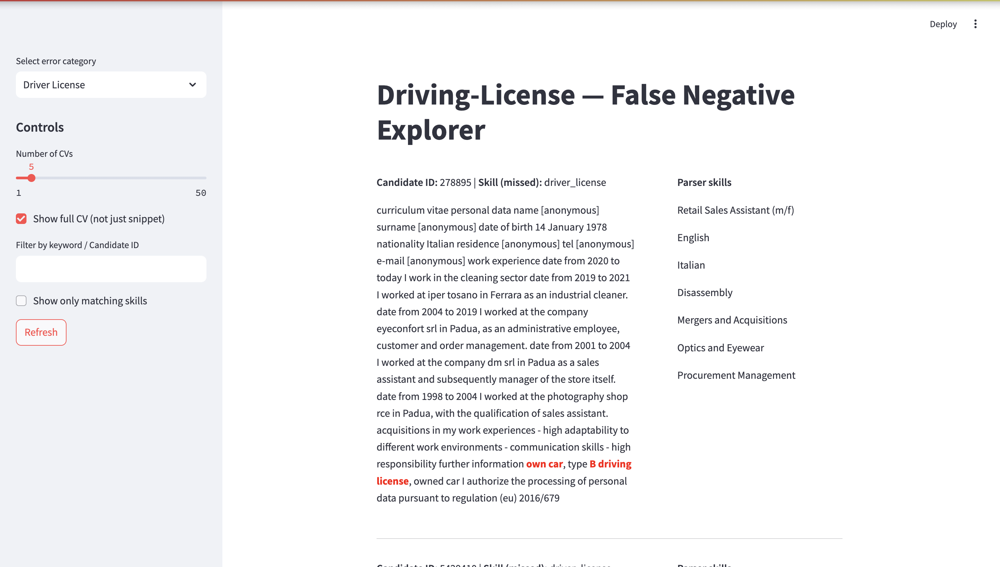

<div align="center">
<h1>Hiring CV bias</h1>

[Francesco Baiocchi](https://github.com/francescobaio), [Leonardo Petrilli](https://github.com/leonardopetrilli)
</div>

## Overview

LLMs can be subject to cultural biases. One such domain is recruiting, where LLMs are used to extract information from candidates’ CVs and then to select the most suitable profiles. These biases may favour or penalize applicants based on language or cultural cues, risking the exclusion of qualified talent.

The goal of this study is to evaluate the **potential biases** in a proprietary CV parser, which automatically extracts skills from anonymized, raw resumes.

<div align="center">
  
</div>


> [!NOTE]
> Because the CV data, although anonymized is proprietary, it cannot be shared to reproduce the experiments using in the hiring_cv_bias module.


To explore the work in detail, visit the page here: [link to the page](#)


## Repository Structure

```text

├── hiring_cv_bias
│   ├── bias_detection.  # 
│   │   ├── fuzzy  # 
│   │   │   ├── parsing.py
│   │   │   └── utils.py
│   │   └── rule_based #
│   │       ├── app
│   │       │   └── labeling_cv_app.py
│   │       ├── data.py
│   │       ├── evaluation
│   │       │   ├── bias.py # 
│   │       │   ├── compare_parser.py
│   │       │   └── metrics.py
│   │       ├── extractors.py
│   │       ├── parser.py
│   │       ├── patterns.py
│   │       └── utils.py
│   ├── cleaning # 
│   │   ├── common.py
│   │   └── raw_cv.py
│   ├── exploration # 
│   │   ├── gender_analysis.py
│   │   ├── utils.py
│   │   └── visualize.py
│   ├── hard_soft_skills_labelling # 
│   │   ├── hard_soft_skill_labelling.ipynb
│   │   └── utils.py
│   ├── translation
│   │   └── translate.py
│   └── utils.py
├── pyproject.toml
├── README.md
└── uv.lock

```